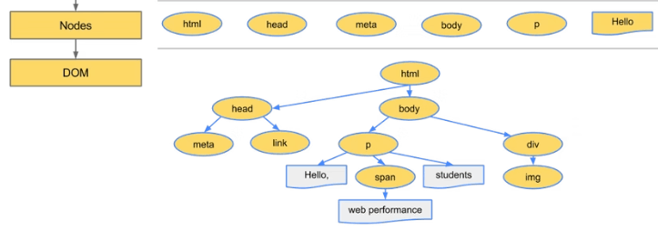
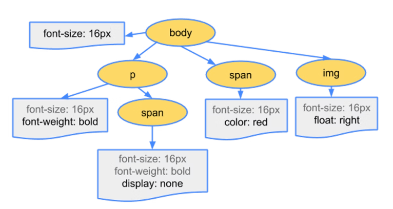

# ブラウザレンダリングの仕組み

## ブラウザがデータを受け取って表示するまでのフロー

大きく４つのプロセスに分けられる。

- Loading ・・・ HTMLやレンダリングに必要なリソースを読み込む
- Scripting ・・・ JSのコードをJavaScriptエンジンに引き渡し、実行する
- Rendering ・・・ レイアウトツリーを構築し、画面上にどのように表示されるか計算を行う
- Painting ・・・ レンダリングの結果を描画する。この段階で初めてピクセルが描画される

# Loading
## Parse
サーバから送られてきたHTMLファイルはバイトデータになっています。  
この状態ではブラウザがHTMLとして解釈できないので、「DOM」に変換する必要があります。  
この作業を **解析「Parse」** と言います。  
  
### Parseのフロー  

## Conversion(Bytes→Charactersに変換)
まず、Bytesから人間が読める文字(Characters)に変換します。  
この時、レスポンスの「Content-Type ヘッダー」で指定された文字コードへ変換します。  
Content-Typeに、文字コードが指定されていない場合は、HTMLのmetaタグのcharset属性に指定されている文字コードが適用されます。  
Content-Typeとmetaタグの両方に文字コードが指定されている場合は、Content-Typeが優先され、両方で指定されていない場合は、バイトデータから推測して文字コードが自動判定されます。
  

## Tokenizing(Characters→Tokensに変換)
ここでは、文字列を一文字ずつ読み込み、`<`と`>`で囲まれているものはStartTag(開始タグ)、`</`と`>`で囲まれているものはEndTag(終了タグ)、`<!--`と`-->`で囲まれているものはComment(コメント)  
などと言ったようにの W3C HTML5 standardで規定されている規則に基づいて、文字列をトークンと呼ばれる塊に分けて意味を与えます。  
  

Tokenには、以下の6種類があります
- Start Tag
- End Tag
- Character
- DOCTYPE
- Comment
- EOF ( End-Of-File / ファイルの終わり )  

また、`
` というように要素に属性が付いていた場合、その情報もトークンの中に保存されます。
## Lexing(Tokens→Nodesに変換)
各トークンはNodeと呼ばれるオブジェクトに変換されます。  
Nodeは、Document、Elementなど大きく12種類存在し、Nodeインターフェイス(機能の設計図)に基づいたプロパティやメソッドを持ちます。  
  
### Node(ノード)とは？
ノードはオブジェクトであり、オブジェクトを作るのに必要なプロパティやメソッドはNodeというインターフェイスで定義されている。  
(※HTMLの要素やその属性、要素に含まれたテキストもノードである)

## DOM construction(Nodes→DOM)
最後に、NodesからDOMと呼ばれるツリー状の形にしていきます。  

このDOM構築のステップでは、元のHTMLソースでネストして書かれていた親子関係をノードにリンクして、DOMツリーに反映させます。  
ノードの数が増えるほど、ツリーの構築にかかる時間は長くなります。  

DOMツリーが出来上がると、HTMLの解析は終了です。  

## CSSOM construction
Webブラウザが、DOMを構築しているときに、CSSファイルへの参照(またCSSの記述)があると、CSSデータをCSSOMに変換します。  
CSSOMは、CSS Object Modelの略で、DOMと同じようにツリー状のデータ構造を取ります。  

CSSデータからCSSOMへの変換は、下記のような流れで処理され、DOMの際に説明したものとほぼ同じ流れとなっています。  

また、CSSOMは下記のようにツリー状のデータ構造を取ります。  

## Render Tree construction
DOMとCSSOMが作成された後に、それらを結合してRender Treeが作成されます。Render Treeは、ブラウザ画面に表示されるNodeだけで構築されます。  

例えば、下記例では、CSSOMでdisplay: noneが設定されているspanオブジェクトや、ブラウザ画面に表示されないheadオブジェクトなどは、Render Treeから除外されます。  

### Render blocking
DOMの構築とCSSOMの構築は並行して行われますが、Render Treeはそれら二つの構築が終わった後に開始されます。その為、CSSファイルが大きくCSSOMの構築に時間がかかる場合は、Render Treeの構築に時間がかかります。  
このようにレンダリングが遅れることをRender blockingと呼びます。

# Scripting

## JavaScript Execution
JavaScriptの実行をJavaScriptエンジンに渡して実行されます。  

JavaScriptのコード⇒字句解析⇒トークン列⇒構文解析⇒コンパイル⇒実行可能コード⇒実行  

Webブラウザが、DOMを構築しているときに、JavaScriptの参照(またはJavaScriptの記述)があると、DOM構築が中断され、JavaScriptコードに則って、DOMやCSSOMに変更処理が加えられます。  
変更処理が終了すると、DOM構築が再開されます。

## Parser blocking
このようにDOM構築を中断させる処理のことをParser blockingと呼びます。

# Rendering
## Calculate Style
DOM要素に対して、どのようなCSSプロパティが当たるのか計算します。  
計算の順序は下記の通り。

1. 全DOM要素にCSSルール内のセレクタがマッチするか総当たりで計算する
2. それぞれのDOM要素にどのようなCSSが適用されるか判断する
## Layout
視覚的なレイアウト情報を計算します。  

- 要素の大きさ
- 要素のマージン
- 要素のパディング
- 要素の位置
- 要素のZ軸の位置  

など  

# Painting
これまでの処理はCPUで行なっていましたが、Paintingでの処理はGPUで行います。
## Paint
まず、描画する要素の順番を決めます。 
要素に `z-index` が設定されていた場合など、要素の重なりを考慮します。

## Composite
これまでの情報をもとに画面上のピクセルに変換します。(Rasterize)  
ピクセルにしてレイヤーを合成させてから最後にレンダリングの結果が生成されます。
