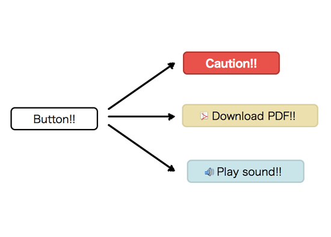
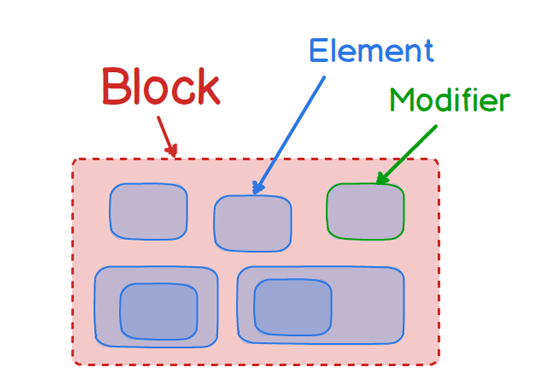

# 【令和最新版】CSS 設計のベストプラクティス

## 前置き

今回の発表内容は個人的見解です。設計はケースバイケースなので、絶対的な正解はありません。  
あくまで、僕個人の一意見として受け取っていただけると幸いです。

# 設計には 2 種類ある

1. システムにおける要件や機能をどのように実装するかの設計(非機能要件やセキュリティなども含む)
2. システムのメンテナンス性や効率化をより良くするための設計(ディレクトリ構成など)

1 → クライアント(価値提供)のために行う設計  
2 → エンジニア自身のために行う設計

今回は CSS における、2 の「システムのメンテナンス性や効率化をよりよくするための設計」について扱います。
これ以降、「設計」という言葉は主に上記の 2 を指します。

# 設計において重要な観点

設計する上での観点には様々あると思いますが...

僕が最も重要視するのは、「関心の分離」です。  
それは、「関心の分離」がメンテナンス性や効率化に直結するからです。

一般的に CSS 設計において重要と言われている条件として

- 「予測がしやすい」
- 「拡張性がある」
- 「保守性がある」

上記の 3 つが挙げられます。

これらの条件を満たすために必要なのは、  
「開発環境のディレクトリ構成が秩序立ったルールの下でカテゴリー分けされている」こと。

「秩序だったルールの下でカテゴリー分けされている」 = 「関心の分離ができている」

# 「関心の分離」と、コードの「可読性」

「関心の分離」ができると、コードの「可読性」が高まります。  
なぜなら、それぞれのコードにおける関数や変数の影響範囲が明確になるからです。

実際にコードを書く際の「可読性」を高める方法は、「アーリーリターン」や「if 文、for 文のネストをできるだけ浅くする」など、様々ありますが、  
「設計」という観点で見た、「可読性の高い状態」とは、それぞれの処理や状態の「影響範囲」が明確であることです。

拡張性や保守性が悪いコードというのは、  
「コードを変更する際に影響範囲が分からない」  
↓  
「変更した後のテストが困難」  
↓  
「怖くてコードを変更できない」

上記のような状態になっていることが多いです。

この状態を防ぐ方法は、やはり「関心の分離」によってコードの「可読性」を高めること。

(僕が Nest.js を好きな理由は、DI によってモジュールの影響範囲が分かりやすい(予測しやすい)から)

# CSS 設計における難しさ

## CSS の特徴

- style の影響範囲が広すぎる
- カスケーディング(詳細度)の適用
- 「!important」という名の設定の破壊者

※CSS は、JS や PHP, Ruby などのプログラミング言語のように関数などによるスコープが作れない  
また、詳細度を理解していないと style を書いても適用されないなどの状態に陥る  
(あと、CSS はエラー文だしてくれない ← 重要)

↓

「CSS 設計は、どれだけ style の影響範囲を絞れるかの戦い」

# CSS 設計の種類

1.

- OOCSS
- BEM
- SMACSS

2.

- FLOCSS
- ITCSS

3.

- ECSS

## OOCSS

Object Oriented CSS の略。  
Nicole Sullivan という人が提唱した考え方。

OOCSS における重要な概念は以下の 2 つ

- ストラクチャ
- スキン

### ボタンのスタイルでの例



ストラクチャは骨組み、スキンは肉付けしてバリエーションを持たせるようなイメージ  
(オブジェクト思考の例で言うと、「抽象クラスとそれを継承したクラス」のような関係)

Bootstrap などで取り入れられている設計手法。

## BEM

Block, Element, Modifier の略。
class 名の名前設計の手法として使用されることが多い。

↓ 基本となる考え方

- ページは、Block というパーツの単位の集まりでできている
- Block は、Element の集まりでできている
- Block や Element の変化を、Modifier で表現する

Block, Element, Modifier の関係



様々な記述の仕方があるが、「Block\_\_Element--Modifier」の記述が多い  
(MindBEMding: https://csswizardry.com/2013/01/mindbemding-getting-your-head-round-bem-syntax/)  
↓ 例

```html
<div class="nav">
  
  <ul class="nav__list">
    <li class="nav__item">アイテム</li>
    <li class="nav__item">アイテム</li>
    <li class="nav__item--borderRed">赤いボーダーのアイテム</li>
  </ul>
</div>
```

## オリジナルの書き方ではないけれど...

↓ のように「Block\_\_Element\_\_Element--Modifier」という Element を繋げて書く方法もよく見る  
この書き方はオリジナルからすると間違いではあるらしいのですが、  
僕はこの Element を繋いで書く方法の方が汎用性が高いのでこの記述方法がいいと考えています。

```html
<div class="nav">
  
  <ul class="nav__list">
    <li class="nav__list__item">アイテム</li>
    <li class="nav__list__item">アイテム</li>
    <li class="nav__list__item--borderRed">赤いボーダーのアイテム</li>
  </ul>
</div>
```

↓ のような html の場合、Element を繋がない書き方もできなくはないが...  
Element を繋げて書いた方が html 構造も把握しやすく、Scss におけるネストの恩恵も受けられる

```html
<div class="media">
  
  <p class="media__title">
    <span class="media__title__main">メインタイトル</span>
    <span class="media__title__sub">サブタイトル</span>
  </p>
  <ul class="media__newsList">
    <li class="media__newsList__item"></li>
    <li class="media__newsList__item"></li>
    <li class="media__newsList__item--borderRed"></li>
  </ul>
  <ul class="media__serviceList">
    <li class="media__serviceList__item"></li>
    <li class="media__serviceList__item"></li>
    <li class="media__serviceList__item--backgroundGreen"></li>
  </ul>
</div>
```

## FLOCSS

↓ 公式からの引用

> FLOCSS（フロックス） は、OOCSS や SMACSS、BEM、SuitCSS のコンセプトを取り入れた、モジュラーなアプローチのための CSS 構成案です。

公式ドキュメント: https://github.com/hiloki/flocss

FLOCSS における概念

1. Foundation
2. Layout
3. Object
   1. Component
   2. Project
   3. Utility

### Foundation

- プロジェクトにおける基本的なスタイル(リセット CSS や、変数など)

### Layout

- プロジェクト共通のコンテナーブロックのスタイル(ヘッダー、サイドバー、フッターなど)

### Object

- OOCSS のコンセプトを元に、プロジェクトにおける繰り返されるビジュアルパターンをすべて Object と定義する

### Component

- 再利用できるパターンとして、小さな単位のモジュール

### Project

- プロジェクト固有のパターンであり、いくつかの Component と、それに該当しない要素によって構成されるもの

### Utility

- Component と Project レイヤーの Object のモディファイアで解決することが難しい・適切では無い、わずかなスタイルの調整のための便利クラス

## 命名規則

MindBEMding  
https://csswizardry.com/2013/01/mindbemding-getting-your-head-round-bem-syntax/

## JS での class 付与

Modifier の命名の派生パターンとして、JavaScript で操作されるような「状態」を表すような Modifier については、  
SMACSS の State パターンの命名を拝借し、`is-*`プレフィックスを付与し、`.is-active`というようにすることもできます。

## JS での class 付与(FLOCSS オリジナルでなく、付け足したもの)

JavaScript で操作する時に付与する、状態以外の class 名は`js-`プレフィックスを付与し、`.js-nav-animation`というようにする。  
(※`.js-nav-animation`は JavaScript によってナビゲーションのアニメーションを操作する時の例)

# CSS 設計のベストプラクティス(Web 制作の場合(Wordpress など))

結論: FLOCSS + JS での class 付与ルール  
ただし、BEM は Element を繋げて書く方法。(Scss でスタイルを書く前提)

また、Utility は最低限に留める  
現時点で Utility に含めていいと思うスタイル: `flexbox`や`grid`などの`display`プロパティ →html の構造とスタイルの指定が影響し合うため

# CSS 設計のベストプラクティス(Web 開発の場合(Vue や React など))

結論: 名前設計は BEM + 最小限の Utility + JS での class 付与のルール

↑Vue や React の場合は、コンポーネント設計が大きく関わってくるので名前設計とその他の最小限のルールに留める  
(※コンポーネント設計については割愛します)

# 最近話題の tailwind CSS について

「ユーティリティファースト」のフレームワーク。  
 予め用意された class を組み合わせて css を書かずにスタイリングを実現する考え方。

tailwind CSS の公式 → https://tailwindcss.com/

# 設計においてもっとも重要なこと

長々と自分の設計思想を語らせていただきましたが、  
設計で一番重要なのは...

「チーム内で、設計の概念やルールが共有されていること」

↓ もっと言うと

- 設計ルールでの用語や概念が、共通言語・共通認識となっていること
- チームの皆がその設計ルールを忠実に守っていること
- ↑ で例外が発生した場合は、チームに相談・共有し了承を得ること

どれだけ素晴らしい設計をしても、そのルールを守らなければ意味がありません。  
1 人が設計に反した実装をするだけで、全てが崩れます。  
あまり設計に縛られるのは良くないかもしれませんが、基礎ができた上で応用があることを忘れてはいけません。

# ご清聴ありがとうございました！
