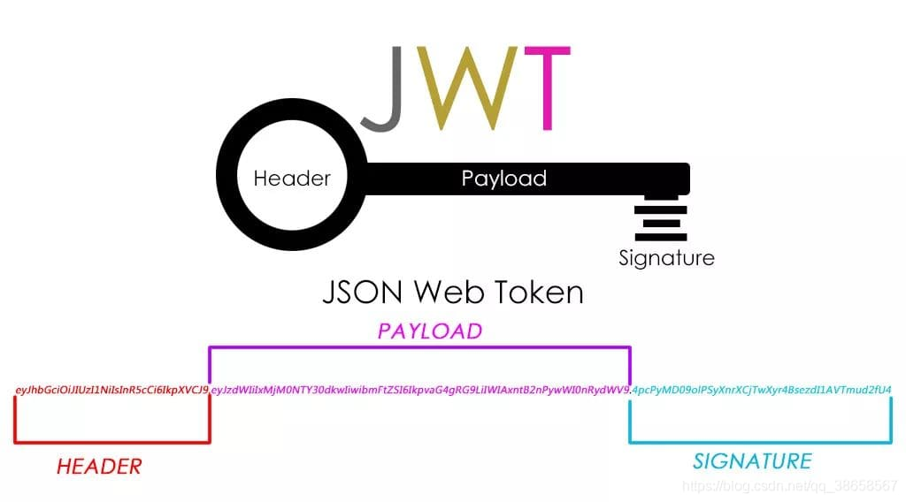
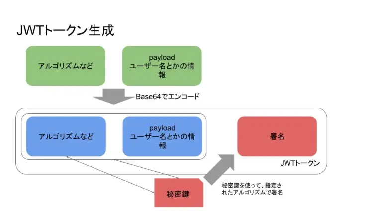
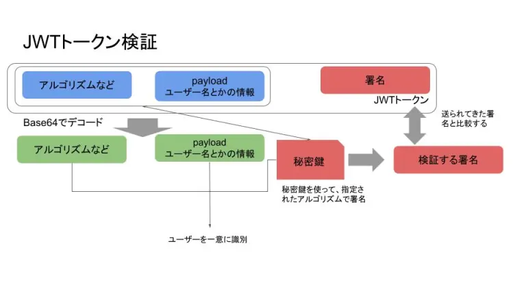

# jwt について

# jwt とは

- JSON Web Token の略

> JWT とは、JSON 形式で表現された認証情報などを URL 文字列などとして安全に送受信できるよう、符号化やデジタル署名の仕組みを規定した標準規格。  
> IETF によって RFC 7519 として標準化されている。

下記の 3 つを「.」(ドット)で繋げたトークンのこと

- header
- payload
- signature

jwt の主な使い道は、

- 認証(Authorization)
- 情報交換

今回は、jwt における認証に関して扱っていきます。

# jwt の仕組み

生成

- JSON に電子署名を加える
- URL-Safe な文字列の Token を生成する

特徴

- あくまで電子署名であり、暗号化ではないため、中身を見ることは可能
- ただし、中身の改ざんをチェックできる(電子署名をしているため)

注意点

- ネットワーク上で盗聴すれば、誰でも簡単に jwt の中身を見ることが可能なので、秘密情報を含めてはいけない
- ↑ と同じ理由で、できるだけ jwt に含める情報は最小限にする
- headerで`"alg": "none"`を受け入れないように設定する

# jwt を使った認証

jwt による認証のメリット

- ステートレスでスケーラブル
- 署名の検証処理だけで済む
- フロントエンドとバックエンドを別ドメインでホスティングしていても認証情報をやりとりできる
- CORS による制限がない(Cookie ヘッダを使用した場合は別)
- jwt に含めた JSON の情報をサーバでの処理の際に使用することができる
- Cookie を使用しないプラットフォームに対してもモバイル対応できる

token の保存場所と注意事項

- Local storage
  - Local storage は特定ドメインに紐づいて保存するため、その他のドメインからはもちろんサブドメインからのアクセスもできないので注意が必要
- Cookie
  - 4KB のデータサイズ制約がある
  - secure 属性・httpOnly 属性をつければ、XSS 脆弱性があってもセッションハイジャックは防げる  
    → しかし、XSS された時点でユーザーの秘密情報や個人情報は盗まれる
  - Cookie ヘッダでサーバへ JWT を送る場合は CSRF 脆弱性は残る & CORS による制約を受ける
  - Cookie 自体を単なる Token の保存先として使用し Authorization ヘッダでサーバに送る場合は CSRF を防げるが、secure 属性が使えない(=https でない場合に通信が見えてしまい、Token が盗まれる可能性がある)
- Session storage
  - Local storage の注意事項 + ブラウザが閉じられたら Token が消える

jwt による認証のデメリット

- 一度発行した jwt(accessToken) の無効化は難しい
  - 一度認可した jwt を無効化扱いすることはできない
  - 有効期限を短くしたり、無効化する必要がある場合は別途仕組みを用意する必要がある

# Token の無効化

- 認証 Token が盗まれた場合などに無効化できるようにする機構があったほうがよい
  - 認証 Token の有効期限を短くするのは保険的対策になる
  - refreshのタイミングで、特定のアカウント(refreshToken)の認証を弾けるようにする(ReauthToken)  
    → 一部ステートフルにする
  - Blacklist を設定できるようにする
  - 本当に最悪のインシデントになった場合は、署名のアルゴリズムや秘密鍵自体を変え、全ての Token を無効化する（全ユーザ再ログインが必要となる）

# jwt の生成と検証の仕組み

## まずは用語の定義を確認
- エンコード
  - 可逆。エンコードのアルゴリズムが分かれば、誰でも元の文字列にデコードできる。  
    →あくまで符号化
- ハッシュ化
  - 不可逆。ハッシュ化する際のアルゴリズムが分かっても、元の文字列に戻すのは難しい。  
    →つまり、ハッシュ化に対しては基本的にデコードというものは存在しない。
- 暗号化
  - 可逆。ただのエンコードとは異なり、秘密鍵や公開鍵を使用するので、鍵が分からないと元の文字列に戻せない。

## token の生成

1. フロントエンド側はユーザー ID・パスワードを送信
2. バックエンド側はユーザー ID・パスワードが正しいかを検証しユーザー情報を DB から取得
3. ユーザー情報から payload を作成
   1. ユーザー ID などが一般的
   2. payload はデコードが容易なのでパスワードなどの機密情報は入れない
4. ハッシュ化するアルゴリズムなどの設定値を指定したヘッダーを作成
5. ヘッダー・payload を Base64 エンコードする
6. 5 の値をバックエンド側が保持している秘密鍵でハッシュ化・署名
7. 5 の値(ヘッダー、payload)と 6 の署名を「.」で繋げたものが jwt トークンとなる

## token の検証

1. フロントエンド側は生成された jwt トークンをバックエンド側に送信
   1. Authorization ヘッダーなどに入れるのが一般的
2. バックエンド側はヘッダー・payload をデコードして、ユーザー情報・アルゴリズムなどの設定値を取得
3. 指定されたアルゴリズムを使って、ヘッダー・payload からバックエンド側が保持している秘密鍵を使って署名を算出
4. 送信されてきたトークンの署名と一致していれば認証成功、デコードした payload のユーザー情報が示すユーザーからのログインと判定

# jwt の脆弱性(セキュリティリスク)
## none-attack
jwtのheaderで指定している`"alg": "HS256"`などの値を`"alg": "none"`に書き換えてリクエストを送る攻撃手法。  
サーバ側で`"alg": "none"`を受け入れない設定がされていないと、改ざんのチェックが行えない。  
(ほとんどのライブラリではデフォルトで`"alg": "none"`を受け入れない仕様になっている。)

## brute-force secret
秘密鍵への総当たり攻撃によって、ハッシュ化の際に使用している秘密鍵を割り出す攻撃手法。  
secret(秘密鍵)の鍵長が短いと簡単に破られる。  
RFCによると、HS256を使う場合は256-bit以上の鍵長を使用しなければならない(must)とされている。  
よって、32文字以上かつ辞書攻撃を防ぐためにランダムな文字列をsecretとして設定するといい。  
(ちなみに、Auth0はHS256のjwtなら512-bitのsecretを使用している)

# まとめ
jwtのメリット
- ステートレスでスケーラブル
- フロントエンドとバックエンドを別ドメインでホスティングしていても認証情報をやりとりできる
- CORSによる制限がない

jwtのデメリット
- 一度発行したtokenの無効化が難しい

jwtの注意点
- payloadには機密情報を入れない
- ハッシュ化(署名)に使用している秘密鍵は外部に漏れないようにする
- headerで`"alg": "none"`を受け入れない設定になっているかライブラリなどの仕様を確認する
- secretには32文字以上かつランダムな文字列を設定する(アルゴリズムがHS256の場合)
