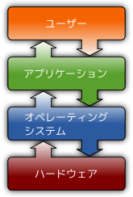
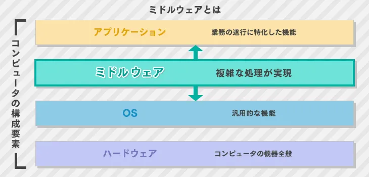

# OS勉強会
趣旨: OS周りの必要な前提知識を知ること

一覧:
1. Linux
    1. Linuxカーネル
    2. ディストリビューション
2. ミドルウェア(middleware)
    1. Webサーバ
    2. APサーバ
    2. DBサーバ
3. ランタイムエンジン(処理系)
4. 用語
    1. デーモン(daemon)
    2. クーロン(cron)
    3. ポート(port)
    4. リストア
    5. リカバリ

### そもそもOSとは？
Wiki↓
> オペレーティングシステムは通常、ユーザーやアプリケーションプログラムとハードウェアの中間に位置し、ユーザーやアプリケーションプログラムに対して標準的なインタフェースを提供すると同時に、ハードウェアなどの各リソースに対して効率的な管理を行う。  
現代のOSの主な機能は、ファイルシステムなどの補助記憶装置管理、仮想記憶などのメモリ管理、マルチタスクなどのプロセス管理、更にはGUIなどのユーザインタフェース、TCP/IPなどのネットワーク、などがある。

参考: https://ja.wikipedia.org/wiki/%E3%82%AA%E3%83%9A%E3%83%AC%E3%83%BC%E3%83%86%E3%82%A3%E3%83%B3%E3%82%B0%E3%82%B7%E3%82%B9%E3%83%86%E3%83%A0

## Linuxとは

Red Hat↓
> Linux® は、オープンソースのオペレーティングシステム (OS) です。  
オペレーティングシステムとは、CPU、メモリ、ストレージなどのシステムのハードウェアとリソースを直接管理するソフトウェアのことで、アプリケーションとハードウェアの間に位置し、すべてのソフトウェアと作業を実行する物理リソースをつないでいます。

参考: https://www.redhat.com/ja/topics/linux/what-is-linux

### Linuxカーネルとは
> Linux オペレーティングシステム (OS) の主要コンポーネントで、コンピュータのハードウェアとプロセスの間のコアインタフェース

> Linuxとは、本来OSのコアであるカーネルといわれるものをさす言葉です。  
カーネルとは、OSの本来の役割であるハードウェアの制御やファイル、ソフトウェアの実行、リソース等の管理を行う部分で、普段ユーザがカーネルの動作を目にすることはありません。

### Linuxディストリビューションとは
Wiki↓
> Linuxカーネルはプロセスやソケット通信などの機能を提供する。  
これらは様々なソフトウェアを動作させるうえで基礎となる重要な機能であるが、ユーザーが利用する機能としては非常にプリミティブである。  
例えばカーネルそのものにはOS起動時のデーモン自動起動機能は存在しないし、Bashのようなインタラクティブコンソール機能も存在しない。これらの機能はすべてLinuxカーネルを利用するGNUなどによって作られた個別のソフトウェアによって実現されている。

参考: https://ja.wikipedia.org/wiki/Linux%E3%83%87%E3%82%A3%E3%82%B9%E3%83%88%E3%83%AA%E3%83%93%E3%83%A5%E3%83%BC%E3%82%B7%E3%83%A7%E3%83%B3

例: RedHat, CentOS, Rocky, Debian, Ubuntu

## ミドルウェア(middleware)とは
アプリケーションとOSの中間に存在するソフトウェア

例:  
Webサーバ: Apache, nginx  
APサーバ: puma, Unicorn  
その他: node

### Webサーバ
ユーザーから送られてきた自サイトへのリクエストを受け取り、なんらかの処理を加えるプログラム。
場合によってはAPサーバにリクエストを投げる。

CSSやJavaScript、画像など、頻繁に変化しないファイルへのリクエストであれば、Webサーバ自身で処理して直接レスポンスを返す。

### APサーバ
アプリケーションを動かしているもの。
Webサーバからリクエストを受け取り、アプリケーションで処理した後Webサーバにレスポンスを返す。

ただ、APサーバはWebサーバを使わずに単体でも実行できる。(例: developmentモード)

Webサーバを使用するのは、その方がパフォーマンスが良くなることが多いから。

### DBサーバ
データ管理機能を有するサービスを提供するサーバ。

#### DBドライバ(クライアント)
アプリケーションからDBへクエリを送信する際や、その結果をDBからアプリケーションへ送信する際に使用する。
OSにパッケージとしてインストールする。

## ランタイムエンジン(処理系)
何らかの信号や符号、データ、情報などに対して決められた処理を行う装置や回路、ソフトウェア、システムなどのこと。  
プログラミング言語で書かれたプログラムコードを取り扱う「言語処理系」を略して処理系と呼ぶことが多い。

OSにパッケージとしてインストールする

### 参考サイト
1. https://it-trend.jp/development_tools/article/32-0044
2. https://qiita.com/jnchito/items/3884f9a2ccc057f8f3a3
3. https://e-words.jp/w/%E5%87%A6%E7%90%86%E7%B3%BB.html
